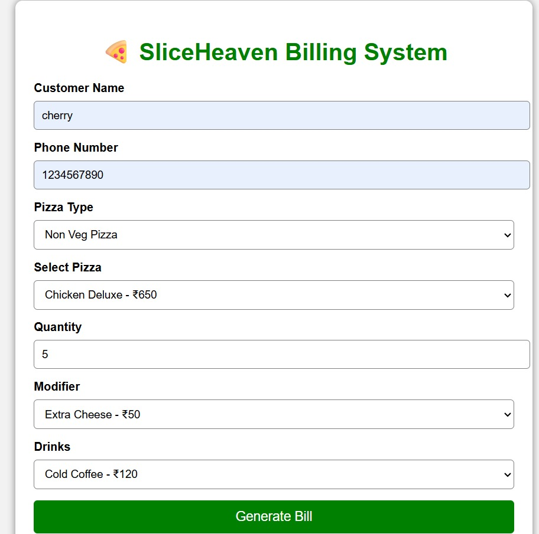
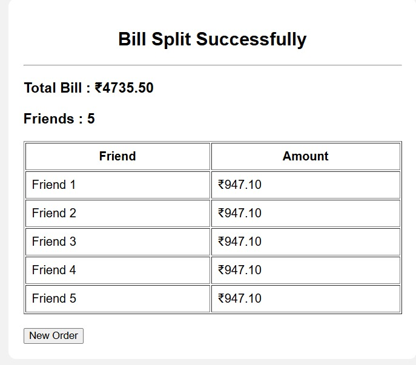
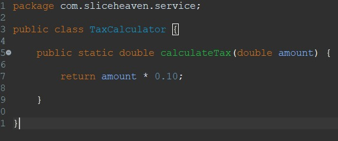
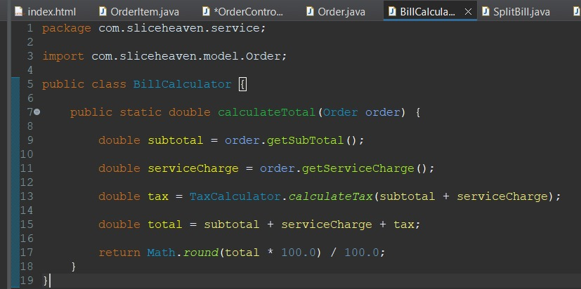

# 🍕 SliceHeaven - Restaurant Billing & Split System

## 📖 Overview

SliceHeaven is a Spring Boot based Restaurant Billing System that helps restaurants generate bills accurately by calculating subtotal, GST, service charges, and splitting the bill equally among customers.

---

## ✨ Features

- Customer Details Entry
- Pizza Selection
- Modifier Selection
- Drink Selection
- Automatic GST Calculation
- Service Charge Calculation
- Bill Generation
- Equal Bill Splitting
- Exception Handling
- Object-Oriented Programming Concepts

---

## 🛠 Technologies Used

- Java
- Spring Boot
- Maven
- HTML
- CSS
- JavaScript
- REST API
- Git
- GitHub

---

## 📂 Project Structure

```text
SliceHeaven_Restaurant_billing-split_System

├── SliceHeavenSpringBoot
│   ├── src
│   ├── pom.xml
│   └── ...
│
├── outputs
│   ├── output-1.jpg
│   ├── output-2.jpg
│   ├── output-3.jpg
│   ├── TaxCalculator.jpg
│   ├── billCalculator.jpg
│   └── SplitBill.jpg
│
└── README.md
```

---

## 📷 Project Screenshots

### Home Page



### Generated Bill


### Split Bill



### Tax Calculator code



### Bill Calculator code



### Split Bill code


---

## 🚀 How to Run

1. Clone the repository.
2. Open the project in Eclipse or Spring Tool Suite.
3. Run the Spring Boot application.
4. Open the application in your browser.
5. Enter customer details and generate the bill.
6. Use the Split Bill feature to divide the total among friends.

---

## 🔮 Future Enhancements

- Payment Gateway Integration
- PDF Bill Generation
- Customer Login
- Database Integration
- Order History

---

## 👩‍💻 Developed by **
  **M.Sai Nikhitha**
